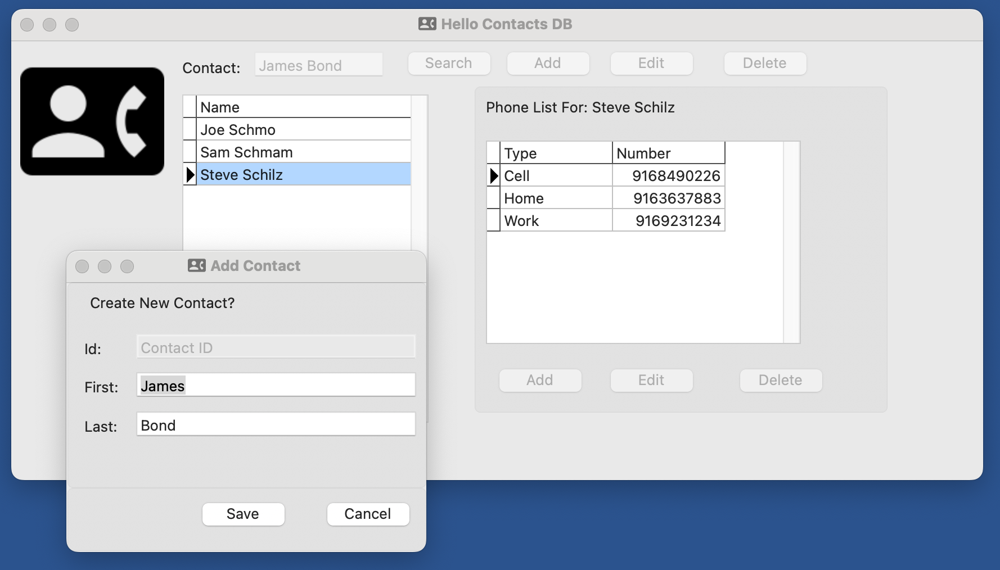

# PascalHelloLazarus
This is a "Hello World" for an SQLite3 database coded using the free, opensource  [Lazurus](https://www.lazarus-ide.org/), which includes the Free Pascal Compiler included. with the Free Pascal Compiler (see [FreePascal.org](https://www.freepascal.org/).    I undertook this project for two reasons:
 1. Because I was interviewing for a job requiring the use of Pascal (in 2023!)
 2. I wanted to review SQL databases.

**Features Demonstrated**

* Basic CRUD use of a relational SQL Database, including auto-create database file from a .sql resource file
* Use of Lazarus IDE forms and database aware components
* Basics of the Object Pascal Language including multiple units, classes, interfaces 

**Design Specifications**

This is designed to be the simplest possible SQL database.  There are three relational tables: People, PhoneNumbers, and PhoneTypes.  You can Add, Edit, and Delete People and Phone Numbers. 

 The full design is available in the "Hello Contacts Database Design" repo. (TBD)

 

## What I Learned

Although the IDE was sometimes glitchy, requiring restarts in order to create new form event methods, overall it was a decent programming experience.   Cross-platform support is present, such as resource files for images, and ability to create the database file in an OS-Recommended location

The Pascal Language is a capable object oriented languge, and the "drag and drop" design experience is Familiar to anyone that has used Borland programming environments (Turbo-C anyone?) or Windows Forms. 

While these environments are fun to program in, they tend to mash together UI code and core logic unless care is taken.   I approached this as follows

* Minimize USE of SQL in the component designer and form files
* Instead, place most SQL in a separate "Utils" module 

## Attributions 

 * Contacts Icon from [Stephen Hutchings Typicons-2](https://www.iconfinder.com/iconsets/typicons-2) icon pack on [IconFinder.com](https://www.iconfinder.com/)
   * License is [Creative Commons Attribution-Sharalike 3.0 Unported](https://creativecommons.org/licenses/by-sa/3.0/)
   * No Changes were made to the icon.
